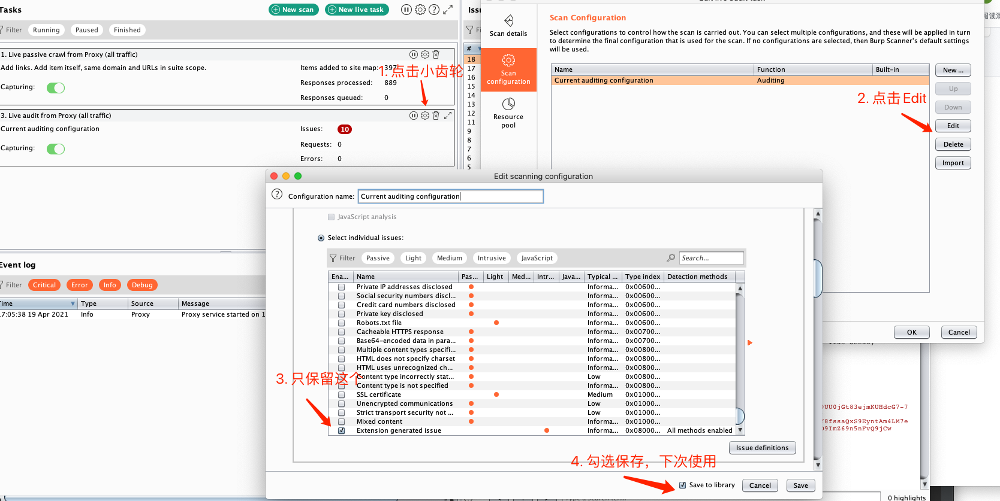

From: https://github.com/MD-Levitan/BurpPlugins/blob/39855ac455b941abfd31bf0e541199e022a2794f/auth_checker.py

## unauth.py
后台未授权检测插件

删除请求头的Cookie或者Authorized，如果返回值的状态码不变，则提示存在漏洞。这里的判断条件写的比较粗糙。
#### 注意事项
修改代码中的WHITE_DOMAIN限定只验证白名单的请求，可以增加正则表达式添加或者删除静态资源接口

#### 使用方法

